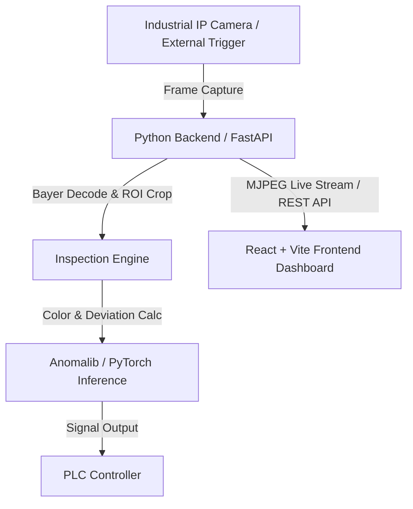

# STD-Deviation-Indicator

**STD-Deviation-Indicator** is a high-performance industrial vision inspection and anomaly detection system. It integrates hardware camera capture (Bayer/RGB IP cameras), region-of-interest (ROI) extraction, standard deviation & color classification, deep-learning anomaly detection via **Anomalib**, PLC signal controls, and an interactive **React web interface**.

---

## Table of Contents

- [Key Features](#key-features)
- [System Architecture](#system-architecture)
- [Repository Structure](#repository-structure)
- [Prerequisites](#prerequisites)
- [Installation & Setup](#installation--setup)
  - [Backend Setup](#backend-setup)
  - [Frontend Setup](#frontend-setup)
- [Configuration Reference](#configuration-reference)
  - [Inspection Config (`config.json`)](#inspection-config-configjson)
  - [Dataset Config (`dataset_config.json`)](#dataset-config-dataset_configjson)
- [API Reference](#api-reference)
- [Frontend Navigation](#frontend-navigation)
- [Experimental & Utility Scripts](#experimental--utility-scripts)

---

## Key Features

- **Live Inspection & Streaming**: Real-time MJPEG live video feed with overlay annotations for inspected regions (slots) and pass/fail indicators.
- **Industrial Camera & Hardware Triggering**: Native support for IP cameras with hardware external line triggers (e.g., `Line0`, `RisingEdge`), auto exposure, gain, and white balance control.
- **PLC Integration**: Serial/Hardware PLC output signals (`Pass`/`Fail` triggers) via discrete I/O or serial communication.
- **Multi-Slot ROI & Color Classification**: Multi-region ROI definitions (`Slot1`, `Slot2`, `Slot3`) with custom color verification and deviation thresholds.
- **Dataset Engine & AI Model Training**: Built-in dataset collection engine for anomaly detection model training with Anomalib and PyTorch.
- **Comprehensive Web Dashboard**: Responsive React UI for live monitoring, camera IP setup, slot indicator config, dataset management, and historical inspection output galleries.

---

## System Architecture



---

## Repository Structure

```text
STD-Deviation-Indicator/
├── app/
│   ├── backend/                      # FastAPI Server & Computer Vision Inspection Pipeline
│   │   ├── api.py                    # REST API Endpoints & MJPEG Streaming Handlers
│   │   ├── inspection.py             # Main Inspection Loop & Frame Processor
│   │   ├── dataset_engine.py         # Dataset Aggregation & Augmentation Engine
│   │   ├── plc_control.py            # Hardware PLC Signal Triggering
│   │   ├── force_ip.py               # GigE Camera IP Configuration Utility
│   │   ├── config.json               # System & Slot ROI Configuration
│   │   ├── dataset_config.json       # Dataset Collection Configuration
│   │   ├── requirements.txt          # Python Dependency Manifest
│   │   └── template/                 # Image Templates & Reference Datasets
│   └── frontend/                     # React Single-Page Web Application
│       ├── src/
│       │   ├── pages/                # UI Pages (Inspection, Config, Galleries)
│       │   ├── components/           # Reusable UI Controls & Navbar
│       │   ├── api/                  # Axios/Fetch API Integration Modules
│       │   ├── App.jsx               # Main Application Routing
│       │   └── main.jsx              # React Application Entrypoint
│       ├── package.json              # Node.js Dependencies & Scripts
│       └── vite.config.js            # Vite Development Server Configuration
├── try/                              # Prototyping & Standalone Verification Scripts
│   ├── classify.py                   # Standalone Color/Feature Classifier Script
│   ├── roi.py                        # Standalone ROI Crop Tester
│   └── indi/                         # Experimental Indicator Utilities
├── README.md                         # Project Documentation
└── .gitignore                        # Git Exclusion Rules
```

---

## Prerequisites

- **Operating System**: Windows 10/11 or Linux
- **Python**: `v3.10` or higher
- **Node.js**: `v18.0` or higher (with `npm` v9+)
- **GPU Acceleration** *(Optional, Recommended)*: NVIDIA GPU with CUDA support for PyTorch / Anomalib model inference.

---

## Installation & Setup

### Backend Setup

1. **Navigate to the backend directory**:
   ```bash
   cd app/backend
   ```

2. **Create and activate a virtual environment**:
   ```bash
   # Windows (PowerShell)
   python -m venv venv
   .\venv\Scripts\Activate.ps1

   # Linux / macOS
   python3 -m venv venv
   source venv/bin/activate
   ```

3. **Install Python dependencies**:
   ```bash
   pip install -r requirements.txt
   ```

4. **Launch the FastAPI backend server**:
   ```bash
   uvicorn api:app --host 0.0.0.0 --port 8000 --reload
   ```
   *The REST API will be accessible at `http://localhost:8000` (Swagger UI at `http://localhost:8000/docs`).*

---

### Frontend Setup

1. **Navigate to the frontend directory**:
   ```bash
   cd app/frontend
   ```

2. **Install Node modules**:
   ```bash
   npm install
   ```

3. **Start the development web server**:
   ```bash
   npm run dev
   ```
   *Open your browser and navigate to `http://localhost:5173`.*

4. **Build for production deployment**:
   ```bash
   npm run build
   ```

---

## Configuration Reference

### Inspection Config (`app/backend/config.json`)

Controls camera hardware acquisition parameters, network IP targeting, output directories, and multi-slot ROI definitions.

```json
{
  "target_device_user_id": "Cam1",
  "use_external_trigger": true,
  "trigger_source": "Line0",
  "trigger_activation": "RisingEdge",
  "pixel_format": "BayerRG8",
  "frame_width": 1100,
  "frame_height": 856,
  "roi_offset_x": 648,
  "roi_offset_y": 816,
  "exposure_time_us": 5000,
  "gain_db": 0,
  "target_force_ip": "169.154.73.1",
  "indicator_slots": [
    {
      "name": "Slot1",
      "roi": [352, 666, 102, 429],
      "expected_color": "Green"
    },
    {
      "name": "Slot2",
      "roi": [48, 341, 498, 784],
      "expected_color": "Blue"
    },
    {
      "name": "Slot3",
      "roi": [420, 721, 637, 941],
      "expected_color": "Orange"
    }
  ]
}
```

### Dataset Config (`app/backend/dataset_config.json`)

Specifies capture parameters and paths used when building reference datasets for deep-learning training.

---

## Frontend Navigation

The Web Dashboard features six primary sections:

1. **Inspection (`/`)**: Real-time live inspection view, live defect counters, and hardware trigger status.
2. **Camera Configuration (`/camera-config`)**: Adjust exposure, gain, white balance, trigger settings, and force camera IP.
3. **Indicator Configuration (`/indicator-config`)**: Interactive ROI bounding box editor for Slot 1, 2, and 3 indicators.
4. **Dataset (`/dataset`)**: Capture positive/negative image samples for training.
5. **Dataset Gallery (`/dataset-gallery`)**: Browse and filter collected training samples.
6. **Output Gallery (`/output-gallery`)**: Historical archive of pass/fail inspection frames and logs.

---

## Experimental & Utility Scripts

The `try/` directory contains helper scripts for standalone testing:
- **`try/classify.py`**: Quick color classification testing on isolated sample images.
- **`try/roi.py`**: Cropping and ROI transformation verification.
